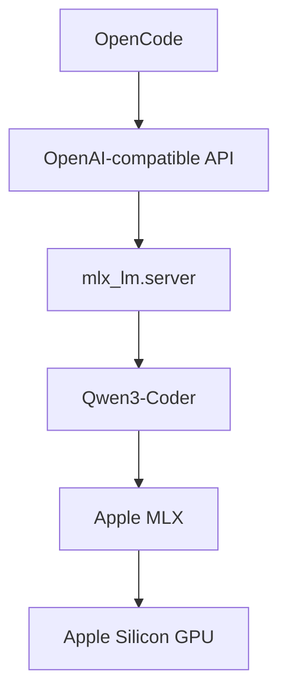
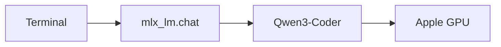
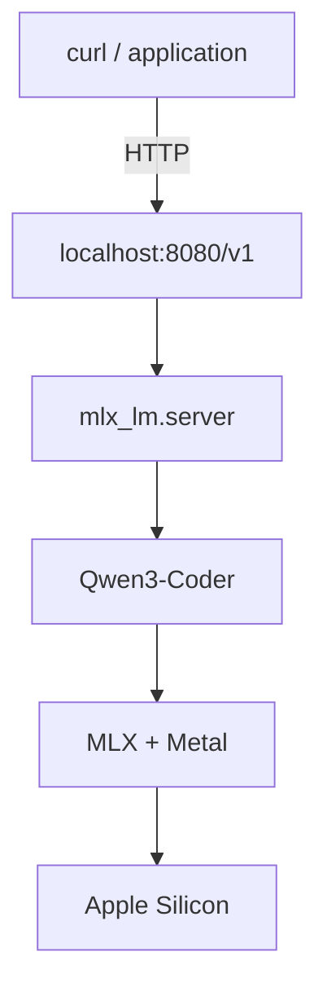
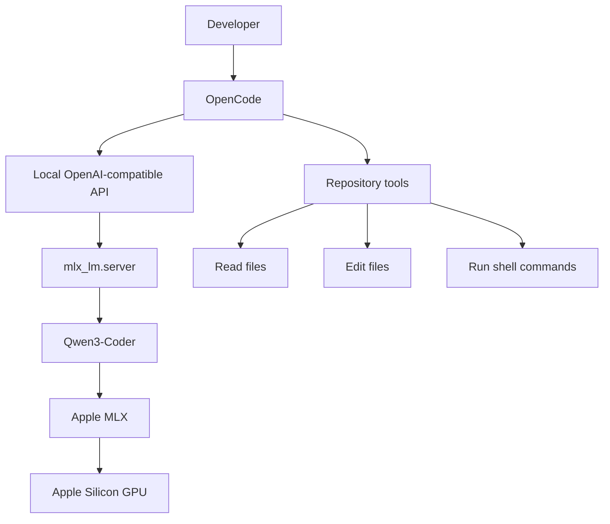

# A local LLM - But, why?

I find the idea of running an LLM locally surprisingly exciting. Instead of sending every prompt, piece of code, or dataset to some remote API, the entire model runs directly on my own machine.
That means more privacy, no per-token costs, and much more freedom to experiment with different models, quantizations, and tools. 
What makes this particularly interesting now is that modern Apple Silicon is powerful enough to run genuinely capable coding models on a laptop. Combined with tools such as OpenCode, this effectively turns the Mac into a self-contained AI development environment that I can configure, inspect, and modify however I want.


## Prelude
Running a large language model locally has become surprisingly practical on modern Apple Silicon.

The goal of this setup is simple: run a capable coding model entirely on a Mac, expose it through a local API, and connect that API to [OpenCode](https://opencode.ai/) so the model can work as a coding agent inside a repository.

The resulting stack looks like this:



In my case, the machine is an Apple Silicon Mac with enough unified memory to comfortably run a 30B-class quantized model. Smaller models work on much less memory.

The main advantages are:

* inference happens locally,
* source code does not have to be sent to an external model API,
* there are no per-token API costs,
* the model can be integrated with coding tools such as OpenCode,
* different models and quantizations can be benchmarked locally.

This guide uses:

* **MLX-LM** as the inference runtime,
* **Qwen3-Coder-30B-A3B-Instruct** as the coding model,
* **OpenCode** as the coding agent interface.

## 1. Install MLX-LM

MLX is Apple's framework for numerical computing and machine learning on Apple Silicon. `mlx-lm` provides tooling for running LLMs efficiently with MLX.

I use `uv` to keep the Python installation isolated.

Install `uv`:

```bash
curl -LsSf https://astral.sh/uv/install.sh | sh
source ~/.zshrc
```

Check that it works:

```bash
uv --version
```

Then install MLX-LM:

```bash
uv tool install mlx-lm
```

Verify the installation:

```bash
mlx_lm.chat --help
```

If this command prints the CLI options, the runtime is ready.

## 2. Run the model interactively

Before adding APIs or coding agents, it is useful to verify that the model itself works.

For a machine with sufficient unified memory:

```bash
mlx_lm.chat \
  --model mlx-community/Qwen3-Coder-30B-A3B-Instruct-8bit
```

The first launch downloads the model automatically.

In this case the model files are roughly 32 GB, so the initial download can take some time depending on the network connection.

Once loaded, MLX-LM opens an interactive prompt:

```text
[INFO] Starting chat session with mlx-community/Qwen3-Coder-30B-A3B-Instruct-8bit.

>>
```

A simple test:

```text
Write a Python function that returns all prime numbers between i and k.
```

If the model responds correctly, local inference is working.

At this point the architecture is simply:



## 3. Expose the model as a local API

Interactive chat is useful for testing, but applications such as OpenCode need an API.

Exit `mlx_lm.chat` and launch:

```bash
mlx_lm.server \
  --model mlx-community/Qwen3-Coder-30B-A3B-Instruct-8bit \
  --host 127.0.0.1 \
  --port 8080
```

This exposes an OpenAI-compatible HTTP API on:

```text
http://127.0.0.1:8080/v1
```

Keep this terminal open while using the model.

### Verify that the server is running

Open a second terminal and run:

```bash
curl http://127.0.0.1:8080/v1/models
```

A successful response should look approximately like:

```json
{
  "object": "list",
  "data": [
    {
      "id": "mlx-community/Qwen3-Coder-30B-A3B-Instruct-8bit",
      "object": "model"
    }
  ]
}
```

This is a useful diagnostic step because it separates model-server problems from OpenCode configuration problems.

## 4. Test an actual completion request

Before involving OpenCode, test the API directly:

```bash
curl http://127.0.0.1:8080/v1/chat/completions \
  -H "Content-Type: application/json" \
  -d '{
    "model": "mlx-community/Qwen3-Coder-30B-A3B-Instruct-8bit",
    "messages": [
      {
        "role": "user",
        "content": "Write a Python function that returns all prime numbers between i and k."
      }
    ],
    "max_tokens": 500
  }'
```

A successful request returns JSON containing an assistant message.

For example:

```json
{
  "choices": [
    {
      "message": {
        "role": "assistant",
        "content": "..."
      }
    }
  ]
}
```

If the response contains:

```json
"finish_reason": "length"
```

the server has not failed. It simply means the model reached the `max_tokens` limit.

Increase it if necessary:

```json
"max_tokens": 2000
```

At this point the important part of the stack is already working:



## 5. Install OpenCode

OpenCode turns the local model into a repository-aware coding agent.

Install it with Homebrew:

```bash
brew install anomalyco/tap/opencode
```

Verify:

```bash
opencode --version
```

Create the configuration directory:

```bash
mkdir -p ~/.config/opencode
```

Then create:

```text
~/.config/opencode/opencode.json
```

with:

```json
{
  "$schema": "https://opencode.ai/config.json",
  "provider": {
    "mlx": {
      "npm": "@ai-sdk/openai-compatible",
      "name": "MLX Local",
      "options": {
        "baseURL": "http://127.0.0.1:8080/v1"
      },
      "models": {
        "mlx-community/Qwen3-Coder-30B-A3B-Instruct-8bit": {
          "name": "Qwen3 Coder 30B Local"
        }
      }
    }
  },
  "model": "mlx/mlx-community/Qwen3-Coder-30B-A3B-Instruct-8bit",
  "permission": {
    "edit": "ask",
    "bash": "ask"
  }
}
```

I recommend starting with:

```json
"edit": "ask",
"bash": "ask"
```

This prevents the agent from modifying files or executing shell commands without approval.

For a local model that has not yet been extensively tested for tool use, this is a sensible safety boundary.

## 6. Validate the OpenCode configuration

JSON errors are easy to introduce manually.

Before starting OpenCode, validate the file:

```bash
python3 -m json.tool ~/.config/opencode/opencode.json
```

If the file is valid, Python prints the formatted JSON.

A common error is accidentally appending multiple configuration objects:

```text
}{
```

OpenCode will then report something similar to:

```text
EndOfFileExpected
```

The config must contain exactly one top-level JSON object.

If necessary, overwrite it cleanly:

```bash
cat > ~/.config/opencode/opencode.json <<'EOF'
{
  "$schema": "https://opencode.ai/config.json",
  "provider": {
    "mlx": {
      "npm": "@ai-sdk/openai-compatible",
      "name": "MLX Local",
      "options": {
        "baseURL": "http://127.0.0.1:8080/v1"
      },
      "models": {
        "mlx-community/Qwen3-Coder-30B-A3B-Instruct-8bit": {
          "name": "Qwen3 Coder 30B Local"
        }
      }
    }
  },
  "model": "mlx/mlx-community/Qwen3-Coder-30B-A3B-Instruct-8bit",
  "permission": {
    "edit": "ask",
    "bash": "ask"
  }
}
EOF
```

## 7. Run OpenCode inside a repository

Create a small test project first:

```bash
mkdir -p ~/Repositories/qwen-test
cd ~/Repositories/qwen-test
git init
```

Start OpenCode:

```bash
opencode
```

Inside OpenCode, check the available models:

```text
/models
```

The local model should appear as something similar to:

```text
MLX Local
└── Qwen3 Coder 30B Local
```

Now the full architecture is:



## 8. Give OpenCode repository context

OpenCode should generally be started from the repository root:

```bash
cd ~/Repositories/my-project
opencode
```

Instead of copying large files into prompts, reference them directly:

```text
Inspect @src/module.py and explain the implementation before making changes.
```

For a bug involving several components:

```text
The problem appears in @src/recovery.py.

Its input is produced by @src/adaptive.py.

Inspect both files and understand the data contract between them before proposing a fix.
```

This is preferable to manually pasting hundreds of lines of source code.

OpenCode can retrieve the files it needs through its repository tools.

## 9. Add persistent project instructions

For larger repositories, run:

```text
/init
```

OpenCode can generate an `AGENTS.md` file describing the project.

This file is useful for persistent context such as:

````markdown
# Project

Python computer-vision project.

## Architecture

- `adaptive.py`: initial trimap generation
- `recovery.py`: recovery of missing detail
- `tests/`: regression tests

## Development

Run focused tests with:

```bash
pytest tests/test_recovery.py -v
````

## Rules

* Preserve public APIs unless explicitly requested.
* Diagnose algorithmic problems before optimizing them.
* Avoid unrelated refactors during bug fixes.
* Never run known runaway reproductions without a timeout or fail-fast guard.

````

This makes future OpenCode sessions substantially more useful because basic repository conventions do not need to be explained repeatedly.

## 10. A good workflow for coding agents

For non-trivial problems, I prefer a staged workflow.

First ask for investigation:

```text
Diagnose the problem in @src/recovery.py.

Do not modify files yet.

Determine:
- what algorithm is implemented,
- what its expected complexity is,
- what invariant appears to be violated,
- how the issue can be reproduced safely.
````

Then ask for a proposed patch:

```text
Propose the smallest fix that restores the intended invariant.

Do not implement it yet.
```

Finally:

```text
Implement the proposed fix.

Preserve the public API.

Add a regression test and run the focused test suite.
```

This tends to work better than giving a broad instruction such as:

```text
fix recovery.py
```

The model has a much smaller reasoning space and the resulting changes are easier to review.

## Debugging hints

### `curl: (7) Failed to connect`

Check whether the MLX server is still running:

```bash
curl http://127.0.0.1:8080/v1/models
```

If not, restart:

```bash
mlx_lm.server \
  --model mlx-community/Qwen3-Coder-30B-A3B-Instruct-8bit \
  --host 127.0.0.1 \
  --port 8080
```

### OpenCode cannot find the model

First verify the API independently:

```bash
curl http://127.0.0.1:8080/v1/models
```

Then validate:

```bash
python3 -m json.tool ~/.config/opencode/opencode.json
```

Only after both work should the OpenCode configuration itself be investigated.

### The model stops halfway through an answer

Check whether the API response says:

```json
"finish_reason": "length"
```

If so, increase the generation limit.

### OpenCode behaves strangely when using tools

Plain text generation and agentic tool use are different capabilities.

Test incrementally:

1. plain chat,
2. reading a file,
3. searching the repository,
4. proposing an edit,
5. editing a test file,
6. running a harmless command.

Do not start by allowing unrestricted shell access.

### Memory usage becomes unexpectedly large

A quantized 30B model consuming tens of gigabytes is expected.

A small Python test consuming 100+ GB is not.

Inspect suspicious processes with:

```bash
ps -ww -p <PID> -o pid,ppid,etime,%cpu,rss,vsz,command
```

Check swap:

```bash
sysctl vm.swapusage
```

Check system memory pressure:

```bash
memory_pressure
```

When debugging coding agents, it is worth remembering that the agent can launch ordinary programs whose resource usage is completely independent of the LLM itself.

## 11. Improving generation speed

The 8-bit model is a good quality baseline, but quantization also affects throughput.

A useful next experiment is the 4-bit version:

```bash
mlx_lm.server \
  --model mlx-community/Qwen3-Coder-30B-A3B-Instruct-4bit \
  --host 127.0.0.1 \
  --port 8081
```

This allows both models to run side-by-side:

```text
8080 → 8-bit model
8081 → 4-bit model
```

Benchmark them with:

```bash
mlx_lm.benchmark \
  --model mlx-community/Qwen3-Coder-30B-A3B-Instruct-8bit \
  -p 2048 \
  -g 256
```

and:

```bash
mlx_lm.benchmark \
  --model mlx-community/Qwen3-Coder-30B-A3B-Instruct-4bit \
  -p 2048 \
  -g 256
```

The most relevant number for interactive use is generation throughput:

```text
Generation: XX tokens/sec
```

More RAM does not automatically mean that higher precision is faster. During autoregressive generation, memory bandwidth is a major constraint, so smaller quantized weights can improve token output speed.

## Conclusion

The setup is conceptually straightforward:


The important part is building it incrementally:

1. get MLX-LM working,
2. verify interactive inference,
3. expose the local API,
4. test the API with `curl`,
5. connect OpenCode,
6. test repository tools conservatively,
7. only then expand permissions and automate more workflows.

This separation makes debugging much easier because every layer can be tested independently.

The result is a capable coding agent running its inference locally on a Mac, with OpenCode providing the repository access and agent tooling around it.

Have fun!
